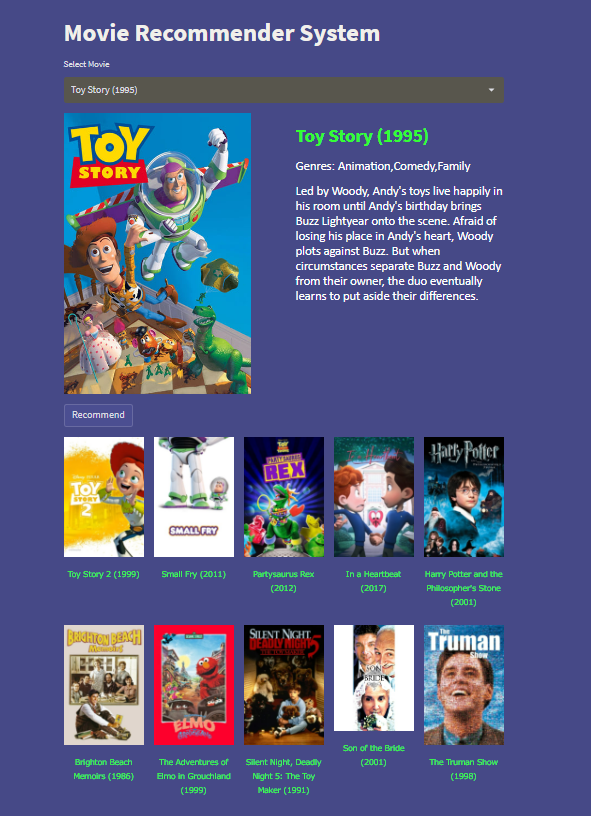

# Content Based Movie Recommender System
> https://movie-reco-sys.herokuapp.com/

### Website Preview
#### Home Page


#### Dataset Source
> https://www.kaggle.com/datasets/rounakbanik/the-movies-dataset

#### Run on your own
Go to terminal and type the following:
```shell
streamlit run app.py
```

## Algorithm
##### Content Based (Recommender Algorithm)
* Content Based filters rely on the similarity of the items being recommended. The intuition behind this being that if a user liked a particular movie or show, he/she might like a movie or a show similar to it.
* Content based filters information by using the cosine similarity method. First tags are generated for each movie basis keywords, overview, genres, cast and crew etc. Then the most frequent tags are selected and their frequencies are calculated for each movie, resulting in a NxM matrix (N movies, M tags). This can be reimagined as N vectors in an M-Dimensional space. The dot product between 2 vectors gives a measure of the 2 corresponding movies' similarity (Cosine similarity).  interactions and data collected by the system from other users. It's based on the idea that people who agreed in their evaluation of certain items are likely to agree again in the future.


